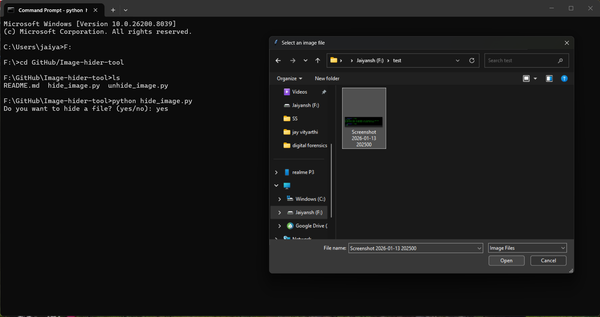
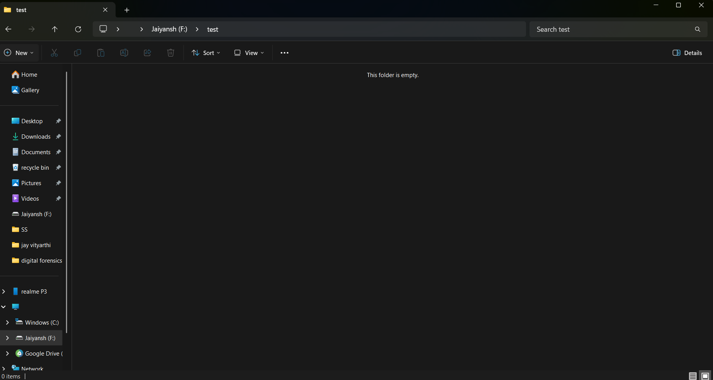
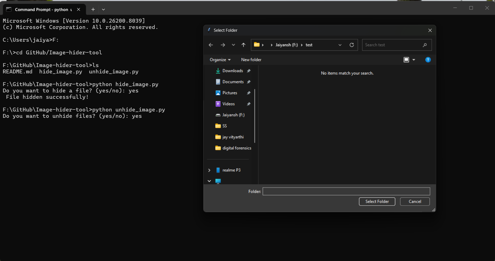
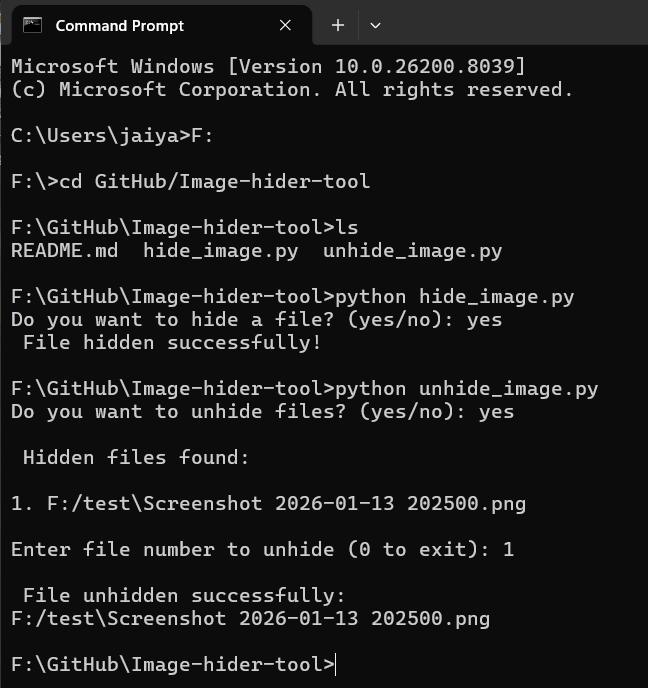
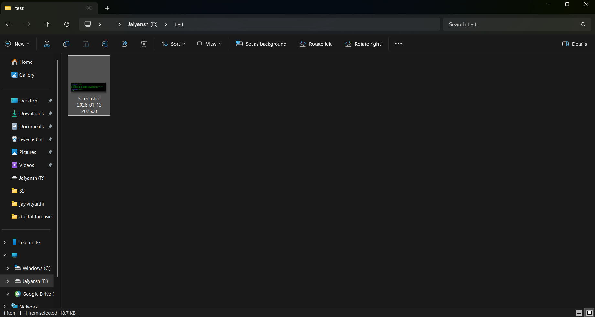

# Image Hider & Unhider Tool (Python)

A simple Python-based tool to hide and unhide files using Windows file attributes.

## Features

* Hide any image file using GUI file picker
* Detect hidden files using Windows API
* List all hidden files in a folder
* Select and unhide specific files

##  Technologies Used

* Python
* Tkinter (GUI)
* OS module
* ctypes (Windows API)

##  How to Run

### Hide File:

```bash
python hide_file.py
```

### Unhide File:

```bash
python unhide_file.py
```

##  Note

* Works only on Windows
* Uses `attrib` command internally

##  Future Improvements

* GUI-based interface
* Multiple file selection
* Recursive folder scanning

##  Screenshots

### File Selection


### Hide Output


### Unhide folder selection


### Unhide file selection


### Before / After

